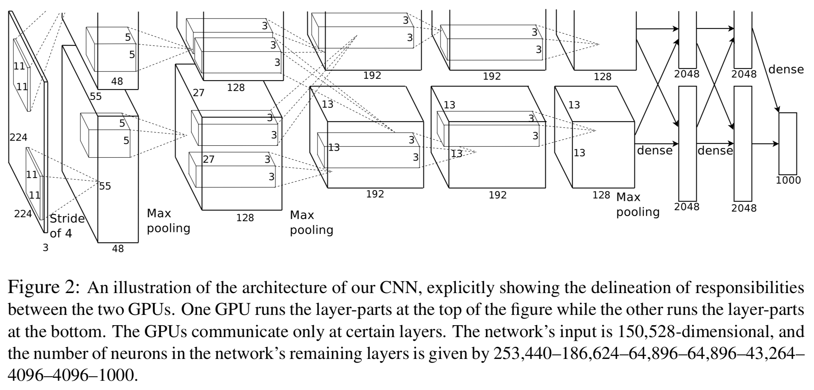
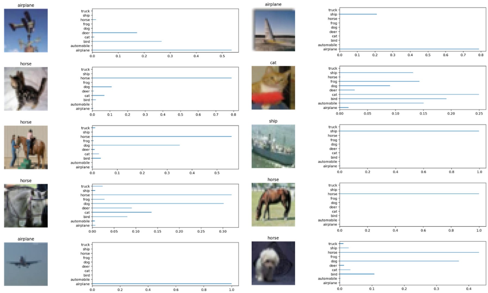

# AlexNet in TensorFlow

This repository comes with AlexNet's implementation in TensorFlow. AlexNet is the winner of the ILSVRC-2012 Competition. 

The original model introduced in the paper used two separate GPUs for architecturing. That was due to the lack of GPU resources (memory) at the time. Because the limitation is no longer applicable for the current GPU technology for the AlexNet, this repository's implementation merged two separate models allocated into two separate GPUs into one.



## Required Packages
- scikit-images
- pickle
- tqdm
- numpy
- tensorflow-gpu (>1.7)

## Usage
- From command line
  -  Will download CIFAR-10 dataset and pre-processing of it, and run the training on AlexNet. It will produce the checkpoint file for performing inference later.
```shell
python alexnet.py
```

- From source code
  - Same behaviour as from the command line.
```python
import cifar10_utils
from alexnet import AlexNet

...
valid_set = (valid_features, valid_labels)
...

alexNet = AlexNet('cifar10', learning_rate=0.0001)
alexNet.train(epochs=20, 
              batch_size=128, 
              valid_set=valid_set, 
              save_model_path='./model')
```

## Experiment on CIFAR-10 dataset
- **Environment**
  - [Floydhub](https://www.floydhub.com/) GPU2 instance (1 x Tesla V100)

- **Approximate running time**
  - 1 hour 45 mins

- **Hyperparameters**
  - Learning rate: 0.00005
  - Epochs: 18
  - Batch size: 64

- **Test Accuracy: 0.6548566878980892**



## Resources
- **alexnet.py :** Providing AlexNet class implementation
- **cifar10_utils.py :** Providing handy functions to download and preprocess CIFAR-10 dataset
- **AlexNet.pdf :** My own summary focused on implementation detail
- **AlexNet.ipynb :** Experimental workflow code on CIFAR-10 dataset
- **External Checkpoint files**
  - providing pre-trained checkpoint file on CIFAR-10 dataset
  - [Download Link](https://drive.google.com/drive/folders/1-bUYAWx6dQ8b5Nw6O_juvZwnNVk-M1Qu?usp=sharing)

## Overall Architecture
**1. Input Layer of Image Size (224 x 224 x 3)**

**2. Convolutional Layer (96 x (11 x 11 x 3)) + stride size of 4**
   - Bias with constant value of 1
   - ReLU Activation
   - Local Response Normalization
   - Max Pooling (Overlapping Pooling)

**3. Convolutional Layer (256 x (5 x 5 x 48))**
   - ReLU Activation
   - Local Response Noramlization
   - Max Pooling (Overlapping Pooling)

**4. Convolutional Layer (384 x (3 x 3 x 128))**
   - Bias with constant value of 1

**5. Convolutional Layer (384 x (3 x 3 x 192))**
   - Bias with constant value of 1

**6. Convolutional Layer (256 x (3 x 3 x 192))**
   - Max Pooling (Overlapping Pooling)

**7. Fully Connected Layer (4096)**
   - Bias with constant value of 1
   - Dropout

**8. Fully Connected Layer (4096)**
   - Bias with constant value of 1
   - Dropout

**9. Fully Connected Layer (1000)**

## Training
- **Optimizer (Implementation) :** AdamOptimizer

## References
- [ImageNet Classification with Deep Convolutional Neural Networks](https://papers.nips.cc/paper/4824-imagenet-classification-with-deep-convolutional-neural-networks.pdf) (Original Paper)
- [Summary Slide](http://cvml.ist.ac.at/courses/DLWT_W17/material/AlexNet.pdf)
- [Summary Slide 2](http://vision.stanford.edu/teaching/cs231b_spring1415/slides/alexnet_tugce_kyunghee.pdf)
- Local Response Normalization
  - https://stats.stackexchange.com/questions/145768/importance-of-local-response-normalization-in-cnn
